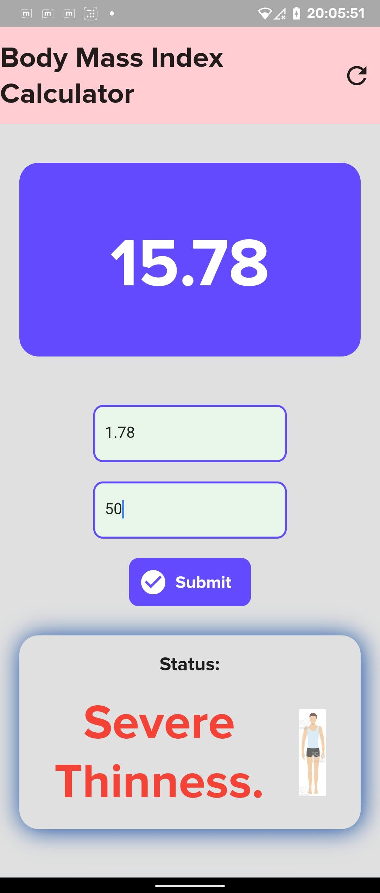
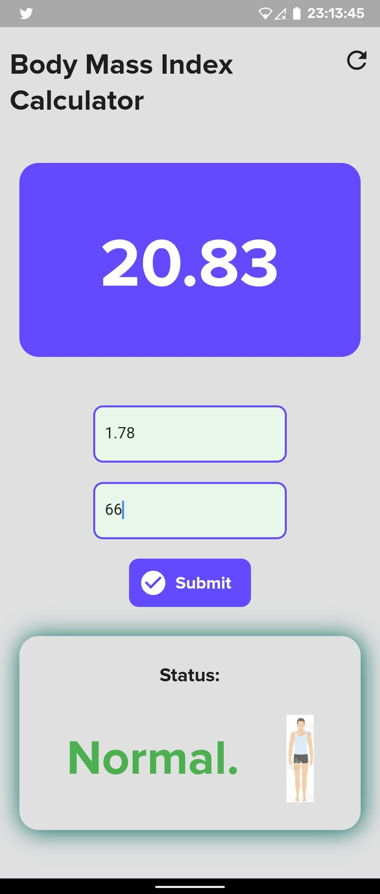
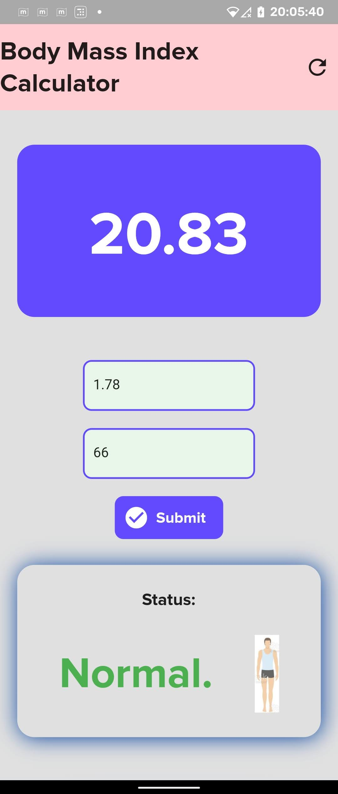

# BMI Calculator App

A flutter project to calculate Body Mass Index for given weight and height.

# Installation

Clone this repo, connect your android device and follow the below instructions:
```
flutter pub get 
flutter build apk --split-per-abi
flutter install
```

OR<br>

You can find the apk in the 'final app apk' folder.

# Screenshots

<p align="center">
    
    
    
</p>

